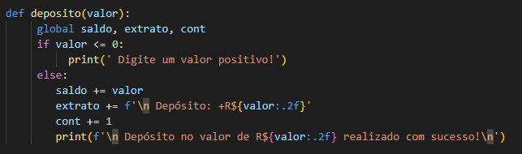
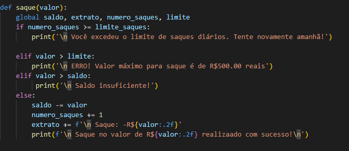
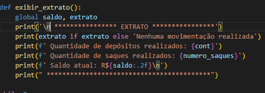

# Sistema Bancário em Python
Este é um projeto de um sistema bancário simples em Python que permite ao usuário realizar três operações principais:

**Depósito**: Adicionar fundos à conta bancária.

**Saque**: Retirar fundos da conta, respeitando um limite de saques diários e valor máximo por saque.

**Extrato**: Exibir o extrato de todas as operações realizadas, incluindo o saldo atual.
## Funcionalidades
O sistema bancário oferece as seguintes funcionalidades:

### Depósito:

- O usuário pode depositar um valor positivo na conta.
- O valor é adicionado ao saldo atual.
- A operação é registrada no extrato.

### Saque:

- O usuário pode sacar um valor, respeitando os seguintes limites:
- Limite de saque por operação: R$ 500,00.
- Limite de saques diários: 3 saques por dia.
- O saque só é permitido se houver saldo suficiente.
- A operação de saque é registrada no extrato.

### Extrato:

- O usuário pode visualizar o extrato das operações.
- O extrato exibe todas as movimentações (depósitos e saques) e o saldo atual.
- Se não houver movimentações, uma mensagem indicará que nenhuma operação foi realizada.

## Melhorias Futuras
- Implementação de um sistema de autenticação de usuário.
- Armazenamento de transações em arquivos ou banco de dados.
- Interface gráfica usando bibliotecas como Tkinter ou PyQt.